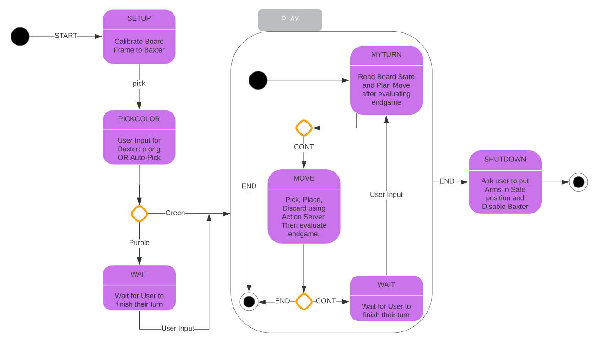

# Baxter Plays Checkers!
## Maurice Rahme, Robert Schloen, Jordan Zeeb, Taoran Zhang
****
## Project Overview

## Quickstart guide
* Download `checkers.rosinstall` to your `/src` directory in your catkin workspace
* `wstool merge` in the same directory. This will download the checkers package and my modified moveit_robots package.
* Make sure you have the rethink robotics workspace installed and sourced.
* Run catkin_make in your catkin workspace after sourcing it.
* Set up the game table.
* Plug Baxter's ethernet cable into your computer.
* Connect to baxter using ` ROS_MASTER_URI=http://10.42.0.2:11311` and `export ROS_IP=10.42.0.1`.
* `roslaunch roslaunch checkers moveit_motion_plan.launch`
* In a separate terminal, `rosrun checkers pick_place_as`
* In a separate terminal, `rosrun checkers smach` (this is the main terminal you will interface with, the others are for debugging and diagnostics)
* Follow the instructions on the terminal where you opened `smach`, you are ready to play!

## Contribution guide (if you are a team member)

**SETUP**

* Fork this repository.
* Use `wstool set` with the SSH to YOUR repository, NOT the group one to automatically set the origin master.
* Then, do `git remote add upstream git@github.com:ME495-EmbeddedSystems/final-project-checkers.git`.
* Now you can push to upstream using `git push upstream` or your own repo using `git push origin` or both using `git push --all`.

**WORKFLOW**

Work on your own branch and push to `origin` whenever you want to back up your progress.

When you are ready to push to `upstream` (the shared repo):

* `git checkout master`
* `git pull upstream master`.
* `git checkout <your_personal_branch>`
* `git merge master`
* Make sure code works and fix any bugs.
* Once everything works, `git checkout master`, and `git merge <your_personal_branch>`
* `git push upstream` and `git push origin`

****
## Nodes and Launchfile

### moveit_motion_plan.launch

### smach
This node is the main interface between the other nodes and scripts in the checkers package. It serves as a state machine with 8 states as shown by the diagram below.

**SETUP**: The user is asked to place Baxter's left end-effector on the top-left crosshairs of the bottom-right square of the board relative to baxter using the provided calibration grippers. Once the position is set, the user can hit Enter on the terminal, and Baxter will move its right end-effector to the location it believes to be the centre of the top-left square of the board. If this belief is false, adjust the board/table and repeat the calibration as necessary. Once the user is satisfied with the calibration, they can hit Enter again to move on to the next phase. 

**PICKCOLOR**: By default, the user is asked to select a color, purple or green, for Baxter. Alternatively, using the `bridge` note and the `play_checkers.py` script, Baxter can figure out its own color by identifying that of the piece closest to it. If Baxter is purple, the user goes first, and vice versa. Once the user hits enter, the state machine will move either to the **WAIT** or **MYTURN** phase depending on the color choice. 

**WAIT**: Here, Baxter waits for the user to play their move. Once the user is done, they can hit Enter to move to the **MYTURN** state.

**MYTURN**: An action client set up within `smach` sends a joint goal to the `pick_place_as` action server to move the right (pick-place) arm to its home position, away from the board, and subsequently the left (camera) arm above the board. Once this is done, the `bridge` node reads the board state and sends a string containing the status of each square (empty, green, or purple) in row-major-order to the `Board_State` topic, which `smach` subcribes to and sends to the `CheckersAI` class either using the `minimax` method, which generates a move using the minimax algorithm sped-up with alpha-beta pruning, or using the `give_command` method, which displays the list of legal moves to the user and asks them to input their choice in the terminal. If the board state indicates that Baxter has lost, the **SHUTDOWN** state is enqueued. Otherwise, the move lit is returned, a list containing at least two integers between `0-63` indicating the board squares in row-major order; these are the pick and place square locations for baxter's move. List elements in addition to the first two indicate squares where pieces must be discared as they have been captured by Baxter's move. Once the move list is generated, it is sent as `userdata` through `smach` into the **MOVE** state. The camera arm is also returned to its home position by sending a joint goal to the action server to avoid obstructing the board. 

Alternatively, the user can choose to decline the AI's suggested move, or to play a move themselves for whatever reason. In this case, a single-element move list containing `None` is passed.

**MOVE**: 

**SHUTDOWN**: Here, the user is asked to put Baxter's arms in a safe position using a `Warning` type message. Then, once the user hits enter, Baxter is disabled.

### pickplace_as

### play_checkers.py

### bridge

### screen

****
## System Architecture