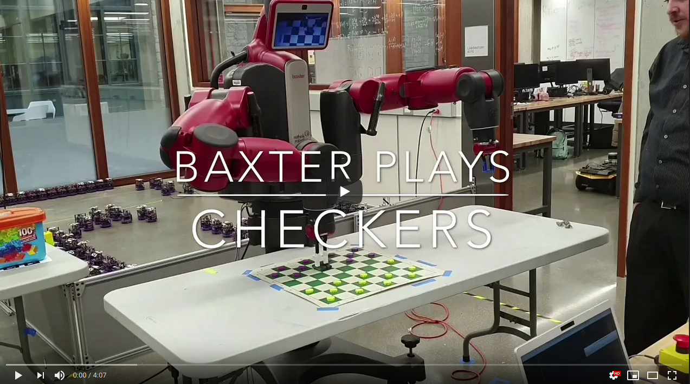
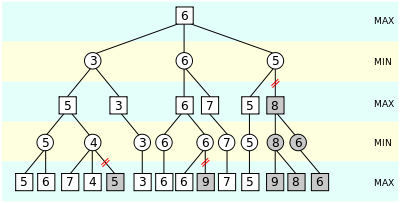

# Baxter Plays Checkers!
## Maurice Rahme, Robert Schloen, Jordan Zeeb, Taoran Zhang
****
## Project Overview
This ROS Melodic package allows a Baxter robot to play checkers using the modern ruleset! You have a choice to play using our custom checkers AI, or against a human-operated Baxter robot. This project was completing as part of the final project requirement for ME495: Embedded Systems in Robotics taught by Prof. Matthew Elwin. This project placed 1st in the judged competition between a total of 6 project teams. The theme for this year's competition was recreational robotics, and the other teams' projects were: Terminator (a nerf-gun shooting robot), Mini-Golf, Cornhole, Tic-Tac-Toe and MegaBLOKS.

Here is a video of an AI-operated game:

## Quickstart guide
* Download `checkers.rosinstall` to your `/src` directory in your catkin workspace
* `wstool merge` in the same directory. This will download the checkers package and my modified moveit_robots package.
* Make sure you have the rethink robotics workspace installed and sourced.
* Make sure you have `MoveIt!` installed: `sudo apt-get install ros-melodic-moveit`.
* Run catkin_make in your catkin workspace after sourcing it.
* Set up the game table.
* Plug Baxter's ethernet cable into your computer and connect using a profile as shown in [this guide](https://nu-msr.github.io/me495_site/lecture13_rethink.html).
* Connect to baxter using ` ROS_MASTER_URI=http://10.42.0.2:11311` and `export ROS_IP=10.42.0.1`.
* Enable the robot if you would like to manually move the arms first: `rosrun baxter_tools enable_robot.py -e`
* `roslaunch checkers moveit_motion_plan.launch`
* In a separate terminal, `rosrun checkers pick_place_as`
* In a separate terminal, `rosrun checkers smach` (this is the main terminal you will interface with, the others are for debugging and diagnostics)
* Follow the instructions on the terminal where you rosran `smach`, you are ready to play!

**VIEWING DOCUMENTATION**
* Run the command `rosdoc_lite .` in the ROS package directory to generate the `html` files containing the documentation. The `html` file are then view able in a web browser.   

## Contribution guide (if you are a team member)

**SETUP**

* Fork this repository.
* Use `wstool set` with the SSH to YOUR repository, NOT the group one to automatically set the origin master.
* Then, do `git remote add upstream git@github.com:ME495-EmbeddedSystems/final-project-checkers.git`.
* Now you can push to upstream using `git push upstream` or your own repo using `git push origin` or both using `git push --all`.

**WORKFLOW**

Work on your own branch and push to `origin` whenever you want to back up your progress.

When you are ready to push to `upstream` (the shared repo):

* `git checkout master`
* `git pull upstream master`.
* `git checkout <your_personal_branch>`
* `git merge master`
* Make sure code works and fix any bugs.
* Once everything works, `git checkout master`, and `git merge <your_personal_branch>`
* `git push upstream` and `git push origin`

**UPDATING DOCUMENTATION**
* To update `.rst` documentation files (when you add new scripts to the python package) run: `sphinx-apidoc -o doc src` in the ROS package directory
* The `.rst` files are used to generate the `html` files containing files.

**ADDING UNIT TESTS**
There is a unittest python script (using ROS wrapper `rosunit`), `get_baxter_moves.py` in the test directory that tests the `get_moves` and `world_to_grid` functions from the `Board` class in the `play_checkers.py` script. This script is for unittesting python code in the python package. The test script checks that he correct number of moves is being returned from the `get_moves` function, which indicates that the legal moves are being generated correctly. The test script has test cases that are representative of the board states that could occur including pawn moves, pawn single and double jumps, pawn and king moves, and king single and double jumps. The test script also includes test cases to check that the `world_to_grid` is reading board states in from computer vision correctly.

* To run test script, in `test` directory: `./get_baxter_moves.py` (Alternatively: `python get_baxter_moves.py`)

****
## Nodes and Launchfile

### moveit_motion_plan.launch
This launchfile begins by launching the `joint_trajectory_action_server` from the `baxter_interface` package, which `MoveIT!` uses to actuate baxter's arms after motion planning. The `baxter_grippers.launch` file from the modified `baxter_moveit_config` package is also included, which loads various moveit parameters pertaining to this Baxter, such as the number of joints in each arm, the types of grippers, and the Inverse Kinematics Solver (Here, we are using TRAC-IK with the Distance Solve Type).

Next, it launches the `bridge` node, which is the computer vision node that reads the board state and sends it to `smach`. It also ensures that both the left and right hand cameras are turned on with maximum resolution (1280x800). Finally, it launches the `screen` node, which displays either the processed image from `bridge`to Baxter's screen, or the image from the pick-place end-effector, depending on instructions by `smach`.

### smach
This node is the main interface between the other nodes and scripts in the checkers package. It serves as a state machine with 8 states as shown by the diagram below.

**SETUP**: The user is asked to place Baxter's left end-effector on the top-left crosshairs of the bottom-right square of the board relative to baxter using the provided calibration grippers. Once the position is set, the user can hit Enter on the terminal, and Baxter will move its right end-effector to the location it believes to be the center of the top-left square of the board. If this belief is false, adjust the board/table and repeat the calibration as necessary. Once the user is satisfied with the calibration, they can hit Enter again to move on to the next phase.

**PICKCOLOR**: By default, the user is asked to select a color, purple or green, for Baxter. Alternatively, using the `bridge` note and the `play_checkers.py` script, Baxter can figure out its own color by identifying that of the piece closest to it. If Baxter is purple, the user goes first, and vice versa. Once the user hits enter, the state machine will move either to the **WAIT** or **MYTURN** phase depending on the color choice.

**WAIT**: Here, Baxter waits for the user to play their move. Once the user is done, they can hit Enter to move to the **MYTURN** state.

**MYTURN**: An action client set up within `smach` sends a joint goal to the `pick_place_as` action server to move the right (pick-place) arm to its home position, away from the board, and subsequently the left (camera) arm above the board. Once this is done, the `bridge` node reads the board state and sends a string containing the status of each square (empty, green, or purple) in row-major-order to the `Board_State` topic, which `smach` subscribes to and sends to the `CheckersAI` class either using the `minimax` method, which generates a move using the minimax algorithm sped-up with alpha-beta pruning, or using the `give_command` method, which displays the list of legal moves to the user and asks them to input their choice in the terminal. If the board state indicates that Baxter has lost, the **SHUTDOWN** state is enqueued. Otherwise, the move lit is returned, a list containing at least two integers between `0-63` indicating the board squares in row-major order; these are the pick and place square locations for baxter's move. List elements in addition to the first two indicate squares where pieces must be discarded as they have been captured by Baxter's move. Once the move list is generated, it is sent as `userdata` through `smach` into the **MOVE** state. The camera arm is also returned to its home position by sending a joint goal to the action server to avoid obstructing the board.

Alternatively, the user can choose to decline the AI's suggested move, or to play a move themselves for whatever reason. In this case, a single-element move list containing `None` is passed. In addition, the processed image from the `bridge` node is shown here by sending "left" to the `arm_img` topic, which the `screen` node subscribes to.

**MOVE**: The moves list is read as `userdata` through `smach`. If the first element contains `None`, a `Warning` is printed saying that no move was played, and the **WAIT** state is enqueued. Otherwise, the action server is sent a pick and place goal using the first two elements of the moves list respectively, and discard goals for every additional element in the list. The cartesian (x,y) coordinates are extracted from the moves list using a stored dictionary which multiplies the width of a square by the number of squares in every direction, and adds this to an offset calclated during the calibration method in the **SETUP** state. The discard place location is hard-coded. These goals are executed using `MoveIt!`'s Python wrapper for their cartesian path planner. While this is happening, the video feed from the right arm camera is shown by sending "right" to the `arm_img` topic, which the `screen` node subscribes to. Finally, the `CheckersAI` class stores whether this move would have won the game. If this is the case, the **SHUTDOWN** state is enqueued and the winner is listed. Otherwise, the **WAIT** state is enqueued.

**SHUTDOWN**: Here, the user is asked to put Baxter's arms in a safe position using a `Warning` type message. Then, once the user hits enter, Baxter is disabled.

### pickplace_as
This node starts an action server which receives PickPlace.action goals of various types and actuates Baxter's arms to perform them using `MoveIt!`'s `moveit_commander` Python wrapper. It can perform the `pick_cartesian` and `place_cartesian` methods, the `joint_goal` method, and the `pose_goal` method, although the latter is only used in case the first two fail to find an IK solution. The different goal types are:

* **home**: if `True`, sets the right arm to its predefined home configuration.
* **camera_home**: if `True`, sets the left arm to its predefined home configuration.
* **camera_view**: if `True`, sets the left arm to its predefined board view configuration.
* **calibrate**: if `True`, records the left end-effector's cartesian coordinates and saves them to be added as an offset to any given `pick` or `place` goals in the future.
* **pick_goal**: Two element float list, containing the x,y position of the `pick` goal to be executed by Baxter's right arm.
* **place_goal**: Two element float list, containing the x,y position of the `place` goal to be executed by Baxter's right arm.

The first three goals are actuated using the `joint_goal` method, while the latter two are actuated using the `pick_cartesian` and `place_cartesian` methods which call `MoveIt!`'s cartesian path planner.

### play_checkers.py
This script contains two classes that are used to generate and keep track of the board state and use AI to select the next move. The script is not executable, since the classes are to be imported into ROS nodes to be run. The first class, CheckersAI, has two functions that are called to provide moves to Baxter. The first function, `give_command`, generates the legal moves for a board state, and requests input from the user as to which move to make. The input from the user is checked against the list of legal moves to make sure the human's input is fair. The other function, `minimax`, generates the list of legal moves from the board state, and then uses the Minimax algorithm with alpha beta pruning to find the next move that Baxter should take. In the case that there was only one move, such as in the case of a capture, that move would obviously be taken immediately without involving the Minimax algorithm. Both functions are passed the string containing the color of piece in each cell, and return a list of indexes referring to board squares containing pieces to move or discard. When it is possible, jumps that capture the opposing player's pieces must be taken. That is reflected in both functions, as only the jump will be returned as the legal moves.

The second class is the Board class. This is where the board state is read in from the computer vision output, and the list of legal moves is generated from the board state. The Board class is only used in the CheckersAI class, and does not need to be called in the ROS nodes. The Board state class generates the moves by first seeing whose turn it is, passed in as an argument, and selecting which direction to take steps in. The board array is set up so that no matter what color Baxter is, its pawns will always takes steps from row 7 of the array towards row 0. This is from the fact that the board state is seen and read in by the computer vision from Baxter's far left corner (the opponent's near right hand corner). To find the legal moves (according to the rules described below), the function loops through each index of the board array and checks if its occupied by the appropriate player's piece and saves any move that takes it into an empty space. It then looks at the diagonal squares either up or down a row depending on if the player is Baxter or not. If the square one step away is occupied by another piece, it checks if it can jump over the piece. If it can jump over the piece it records that move, then checks again if it can make another jump. If successful it records the double jump. Technically there is no limit to the number of times a piece can jump the opponents pieces, aside for the number of pieces remaining, but this current implementation of move generation only checks up to double jumps. We found that while possible, it was fairly rare to have more than a double jump, so this has not been an issue yet. This will be improved in future work on this project. The list of moves, or in the case of a jump just the one move, is returned along with the position of any captured pieces.

The Board class also keeps track of any kings on the board. Since the computer vision only detects which team a piece belongs to, but does not differentiate between pawns and kings, king tracking is handled internally. The Board class keeps attributes containing a list of the positions of Baxter's and the opponents kings. It updates Baxter's list when Baxter's move is made since it knows Baxter's moves. Since it doesn't know what move the human opponent made, the function compares the current board state to the previous one and looks for any differences. When it finds a difference, depending on the piece color and whether a piece that was moved was on the king list, it will either update the value to reflect the kings already on the list of kings for both players, or if the opponents piece becomes a king it adds that king to the king list and will keep track of it from then on. This functionality has not been fully tested on Baxter as of yet, but is at the top of the list of future work.

#### Rules of the game
For those of you who are not familiar with the rules of checkers, each player has 12 pieces, often called pawns. Kings are achieved when a pawn get to the opposite side of the board, but cannot move again on the same turn they become kings. All pawns for both players are placed on board squares of the same color starting from each player's left hand corner. Pawns can only move forward diagonally, so that they stay on the same colored square as they previously occupied. Kings can move both forward and backward, but otherwise follow the same movement rules as pawns. Pawns and kings cannot move into a square containing another piece, and cannot jump over, that is move two squares diagonally, a pawn or king of of its color. Pawns and king can jump over pieces of a different color, the other player's pieces, and this is called a capture. When a capture is available, it must be taken. A single piece can capture multiple pieces in a single turn. The game is over when one player captures all of their opponents pieces, or when the opponent has no moves. There can also be a draw when both players have made 40 moves and no piece has been captured, or when the exact same board state has been achieved three times.      

#### Minimax with alpha beta pruning
The Minimax algorithm is a fairly straight forward recursive tree search algorithm that is useful for selecting moves in zero-sum full information games like checkers and chess. Starting from the root, each layer is assigned to be either maximizing or minimizing, and the successive layers alternate between the two. For example, we are looking for Baxter's best move for a given board state, so we make the root a maximizing layer. The next layer, where the other player is making a move is then made a minimizing layer. This pattern continues down the tree where its a maximizing layer when Baxter is making a move, and a minimizing layer when its the opponents turn. From the root, moves are applied to the board state until a win condition is reached, or a certain depth of the tree is reached. At that point, the board state is scored, and that score is returned to its parent node. The minimum or maximum, depending on the assignment of the layer, of all the children is taken to determine the score for the parent. This is continued up the tree until it reaches the root, by which point we have the move from the root that should result in the best situation for Baxter. The maximum depth of the tree, how many moves ahead to look, is important for how long it takes to traverse the tree. You can image that looking at 7 moves, then 7 more moves for those moves quickly expands into a very large number of moves to score. As a result the Minimax algorithm by itself is slow and inefficient since it checks every branch, even when a better move has already been found.

To counter this inefficiency, alpha beta pruning is added. Alpha beta pruning is an optimization technique for the Minimax algorithm that takes advantage of the pattern of minimizing and maximizing layers. The alpha beta pruning uses to additional variable, alpha and beta, to allow it to look further back once it has reached a terminal node. Alpha and beta keep track of the max and min values of the children for the parent node, so once a child is found to have a worse score than the current max or min, the rest of that child's branches are not considered since in the next layer up it can't be better than the score already found. This reduces the number of branches explored and nodes evaluated, reducing the amount of time it takes to traverse the tree. For comparison, when using the basic Minimax algorithm for out implementation, we can only go 4 layers deep (moves ahead) before the time it takes to search the tree exceeds a reasonable time frame to play the game (more than 2 minutes). When using the alpha beta optimization, it could go 9 layers deep before the time it took started to get too high. The alpha beta pruning more than doubled the depth of the tree that could be explored to find the best move. It can be hard for an average human to tell what the best move for a given board state is since it is possible that you miss something and you can't see too many moves ahead. To test that the algorithms were in fact giving the best moves, I compared the basic Minimax to the Minimax with alpha beta pruning. This was done to the same depth, and after confirming that both algorithms passed the scores up the tree correctly. Both algorithms returned the same moves, which suggests that the algorithms were in fact returning the best moves.

Image source: Wikipedia, 

The scoring of the board state at a terminal node was done by counting the number of pieces left on the board after the move was made. Besides counting the pieces to check if the game was over, pawns were one point, kings were two points, and additional points were given if the piece was near the center of the board (between certain rows, add a point, and columns, add a point). Since captures were forced, and therefore the minimax was not needed, they were not explicitly included in the score, but are implicitly represented in the number of pieces. Finally, if the terminal node was a win condition, ten points were added to the score to weight those outcomes more heavily. These scores were calculated for both sides, and the overall score for a board state was Baxter's total minus opponents total. This meant that if Baxter was winning it would have a positive score and if Baxter was losing it would be a negative score. This works since Baxter is maximizing and the opponent is minimizing.         

### bridge
This is the computer vision node that reads the state of the board by subscribing to baxter's left hand's camera image.  This node outputs the state of the board to a service called Board_State as well as its augmented image, called proc_img, to baxter's monitor.  This node works by using findCheckerboardCorners in openCV
to create a coordinate system relative to one of four inner corners.  Then it projects
where it thinks the center of each square is in those new coordinates.  Then it looks for
each color and finds the center of each contour big enough to be a piece.  For each contour, it checks the distance it is from each square in image coordinates, and if it's within a certain tolerance it replaces the 'empty' default status to that piece's color ('green' or 'purple').  The output is a string of 64 words, separated by spaces, telling the status of every square in that frame.  Just outputting the status of each square and not the exact position of the piece can only work with the custom v-grip grippers.  Each board requires it's own grippers, with their width equal to the boards square width.  If the bridge node were to output the exact coordinates, then baxter might hit into a different piece when going for a piece that is positioned off center, so the grippers require the output of the center of the square coordinates to work properly as well.

The bridge node also used the camera matrices provided from the calibrate_camera.py script in the scripts directory.  With this script, you can load about 15 images from that camera with a checkerboard in them and it will print the camera matrices to the screen, which were saved in the bridge node.  These camera matrices would have to be updated for each camera.

A simple unit test script called bridge_unit_test.py was also added to check if the topic Bridge_State is being published and if it is outputing 64 square states.
### screen
This node subscribes to the `/arm_img` topic to read String messages. In parallel, it also subscribes to `/cameras/right_hand_camera/image` and `/proc_img`, the right and (processed) left arm images of the Baxter robot respectively. If it reads "right", it publishes the former to the topic `/robot/xdisplay` (which Baxter subscribes to in order to show images to its screen), and if it reads "left", it publishes the latter, the processed CV image.

****
## System Architecture
The main interfacing actor in this system is the `smach` node. It actuates the state machine at the heart of the project, imports the `CheckersAI` class from `play_checkers.py`, acts as an action client to the `pick_place_as` action server (which in turn controls the robot's arms using `MoveIt!`), subscribes to a topic by the `bridge` node to read the board state and relay it to `CheckersAI`, and finally, publishes "left" or "right" String messages so that the `screen` node can publish the correct image on Baxter's screen.

When sending a `PickPlaceAction` goal to the `pick_place_as` server, the `smach` node receives feedback as the robot's end-effector moves through key positions, such as home, pick_standoff, pick, place_standoff, and place. It also receives a result "compromised" or "uncompromised", indicating whether the cartesian path planner was successful. This is metric is determined by the `fraction` variable returned by `MoveIt!`, indicating the fraction of the path that was successfully planned. Here, `0.9` is taken as a successful value. Notably, no checks on path **execution** success/failure is considered here, presenting a good way to improve this project.

## Future Work
A big improvement would be to add a re-planning feature using Force Control. For example, if Baxter detects that it should have picked up a piece when it in fact did not, it should try the move again. This should be easy to achieve using the existing structure of the action server. In addition, while the `MoveIt!` methods were generally robust (an average of 2 failures per 30-minute game), some further optimization could be done, such as having more hard-coded home positions for the picking arm depending on reachability, using the camera arm as a secondary picking arm, or performing the motion planning from scratch by using the methods described in [Modern Robotics Package](https://github.com/NxRLab/ModernRobotics/tree/master/packages/Python). It should also be possible to dive deeper into the failure cases for `MoveIt!` and abort/resume a motion plan at a failure point as the current implementation only checks for failures in planning, not execution. As an aside, `MoveIt!` seems more suited for use with C++ as opposed to Python, as it contains more methods and more robust ones for those also supported in Python.

In addition, calibrating the z-coordinate for the pick-place actions is tedious, and Force control could be used to semi-automate that process for differently sized or situated tables.

With regards to the Minimax with alpha beta pruning, the evaluation function could likely be improved to better capture the advantage of one player over another. Additionally, the search itself could be further optimized by ordering the moves it searches through, so that it starts searching through moves that are more likely to be successful and the worse moves are pruned sooner. It would also be interesting to compare the performance of the Minimax search algorithm to a machine learning algorithm like Neural Networks.   

Finally, although we have tested king conditions in code, we did not get the chance to implement them on the real system before the demo (and before this video was taken), so that is the most immediate point of improvement.
